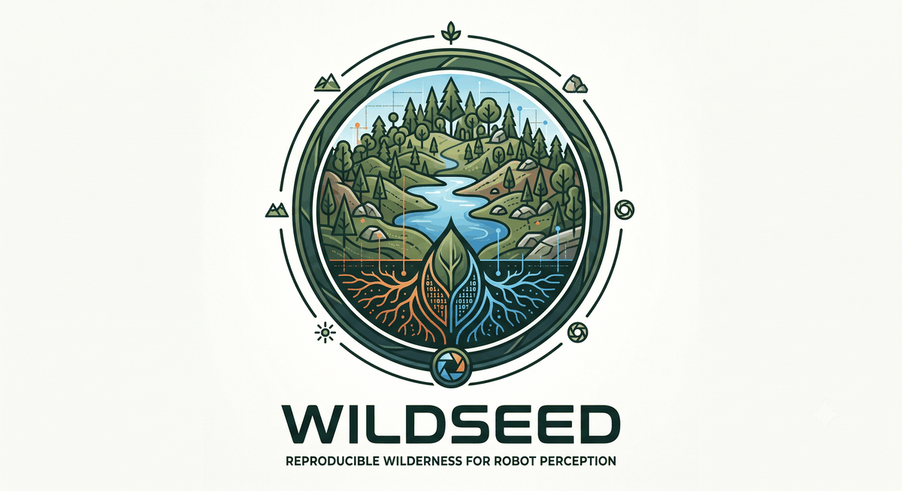
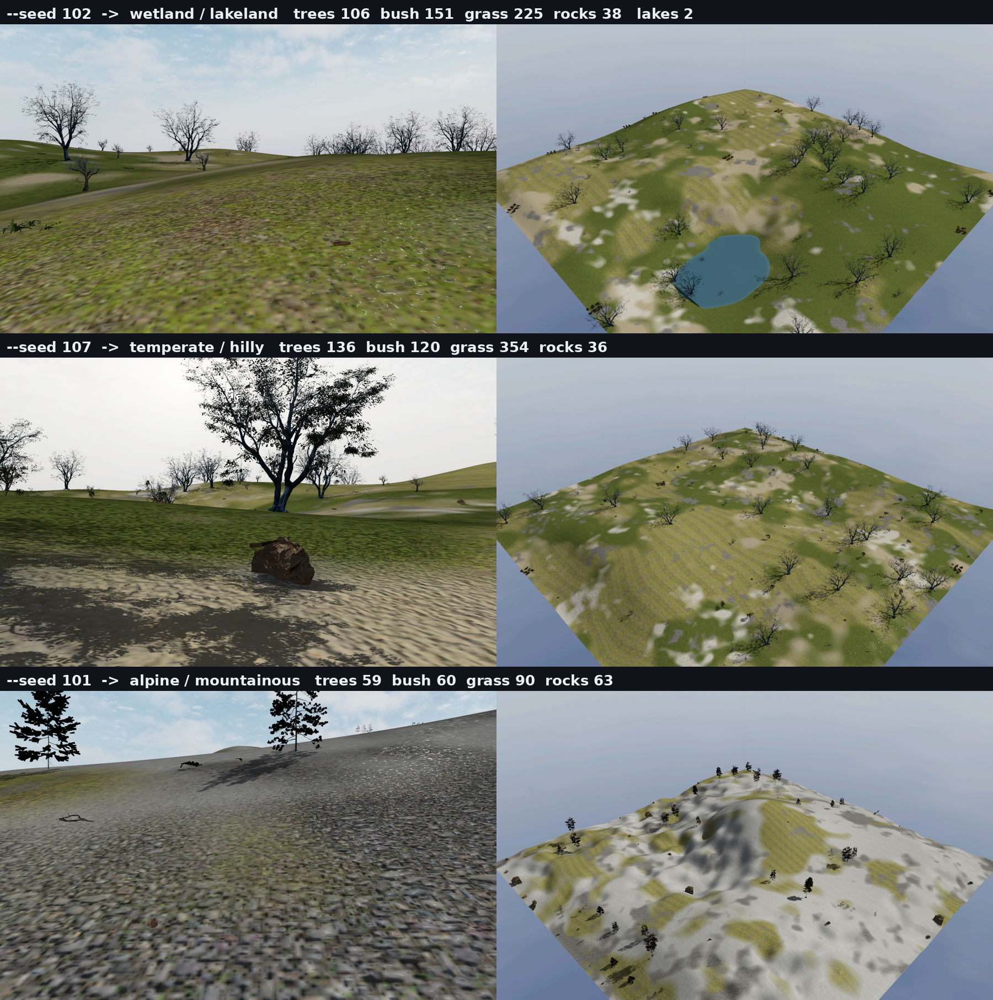
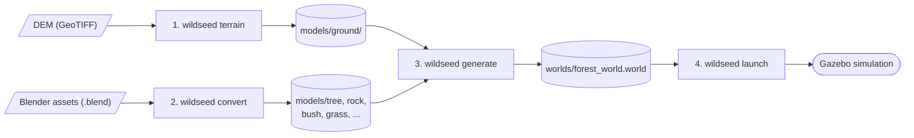
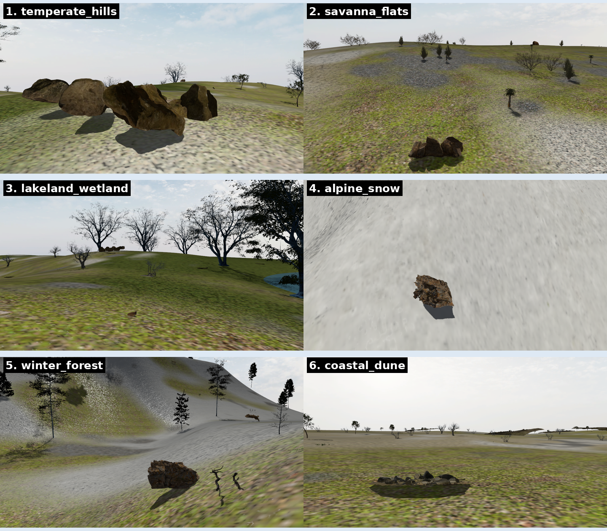

<p align="center">
  
</p>

# WildSeed — reproducible wilderness for robot perception

**One seed, a whole wilderness.** WildSeed generates randomized, feature-rich outdoor
**[Gazebo](https://gazebosim.org/)** worlds for testing VIO / LIO / SLAM algorithms —
procedural terrain, seeded ground materials, lakes, and hundreds of placed
freely-licensed plants and rocks — and every world is **reproducible from a single
master seed**, so a failing odometry run can name the exact world it saw and anyone
can regenerate it.

Everything here is built around **[Gazebo Sim Harmonic](https://gazebosim.org/docs/harmonic)**:
each generated world is a standard SDF `.world` file you launch with plain `gz sim`
(no custom plugins to install), and the bundled Docker images ship Gazebo ready to run.

**Scope: worlds only.** Robots, sensors and autonomy stacks are deliberately out of
scope and live in a separate repository — WildSeed generates the environments they
are spawned into. (The only sensor-adjacent piece here is a printable lens-flare
camera-plugin snippet, see `wildseed weather -w <world> --show-lens-flare-snippet`.)

[](https://gazebosim.org/docs/harmonic)
[](https://www.gnu.org/licenses/agpl-3.0)
[](https://www.python.org/downloads/)



*Three master seeds, three worlds: `--seed 101` grows a lakeland wetland,
`--seed 107` rolling temperate hills, `--seed 108` an alpine massif. Same seed →
identical world, always.*

## Demo videos

**Orbit over the temperate-hills demo scenario** — `wildseed record -p orbit --seed 5`
(kinematic, 20 fps):

https://github.com/user-attachments/assets/4586c0da-d826-49f9-8eb0-7f19e744c49d

**Low flythrough through a dense temperate build** (~2,500 instances, single-sun
shadows + procedural sky) — `wildseed record -p flythrough --seed 11 --agl 6`
(kinematic, terrain-following):

https://github.com/user-attachments/assets/8b1199a6-b1c0-4bee-8ea6-05a57d2f5078

**Dynamic "hand-of-god" dolly with a physically consistent IMU** —
`wildseed record -p dolly --seed 3 --mode dynamic --dataset` (PD-wrench flight,
3 cm mean tracking error, full lidar/IMU/GPS/ground-truth dataset dumped alongside):

https://github.com/user-attachments/assets/04964c7b-7570-4eff-95f7-7894b2115d6c

*Every flight is byte-reproducible: same seed ⇒ same trajectory ⇒ same video.
Recorded with [`wildseed record`](#test-worlds-with-the-sensor-rig-fly--record); the
videos are hosted as GitHub attachments and are not part of the repository.*

## Pipeline

WildSeed follows a 4-step pipeline to generate simulation environments:



| Step | Command | Input | Output |
|------|---------|-------|--------|
| 1 | `wildseed terrain` | DEM file (.tif) | Terrain mesh + SDF model |
| 2 | `wildseed convert` | Blender files (.blend) | Gazebo models (glTF + SDF) |
| 3 | `wildseed generate` | models/ directory | World file (.world) |
| 4 | `wildseed launch` | World file | Gazebo simulation |

**Example workflow:**
```bash
# Step 1: Generate terrain from DEM
wildseed terrain --dem ./dem/terrain.tif

# Step 2: Convert Blender assets (auto-detects categories from subfolders)
wildseed convert -i ./Blender-Assets -o ./models

# Step 3: Generate forest world (places models on terrain)
wildseed generate --density '{"tree": 50, "rock": 10, "bush": 20}'

# Step 4: Launch Gazebo to view the result
wildseed launch
```

## Procedural terrain & seeded scenarios

Beyond meshing a fixed DEM, WildSeed can **synthesize** varied, seeded landforms —
rolling hills, mountains, valleys, flatlands, basins→lakes, creeks — and randomize
whole scenarios reproducibly (same `--seed` → same world) for VIO/lidar testing.

**One command, one master seed** — `wildseed scenario` chains every stage
(landform → mesh → ground material → water → model placement), deriving each
stage's seed from the master seed and drawing the biome, terrain shape and
densities from per-biome envelopes. Eight biomes: six wilderness (temperate,
savanna, wetland, alpine, winter, coastal) + two structured plantations
(`orchard`, `vineyard` — repetitive rows, the loop-closure stress test). Every
world ships with `scenario_<seed>.yaml` (the full resolved recipe — any world
reproduces from its seed alone) and `scenario_<seed>.instances.json`
(per-instance ground truth: model, category, pose, scale):

```bash
wildseed scenario --seed 42                      # fully random, byte-reproducible
wildseed scenario --seed 42 --biome alpine       # fix the biome, randomize the rest
wildseed scenario --seed 7  --density-scale 1.5  # denser variant of seed 7
wildseed scenario --seed 7  --dry-run            # print the resolved recipe only
```

The individual stages remain available for manual control:

```bash
wildseed terraingen --preset lakeland --seed 7 -o dem/synth.tif   # synth landform
wildseed terrain    --dem dem/synth.tif                           # mesh it
wildseed ground     --mode patchy --biome grassland --auto-water --dem dem/synth.tif
wildseed generate   --density '{"tree":35,"rock":12}' --seed 7    # populate
```



Six ready-made demo scenarios (two snow) — **temperate hills, savanna flats,
lakeland wetland, alpine snow, winter forest, coastal dune** — each with a 3-layer
structure (canopy trees / understory shrubs / grass + flowers) built from **CC0
Poly Haven assets** and reproduced with **no account or login**:

```bash
# NOTE: the demo renderer needs a GPU (ogre2/EGL). Run inside the wildseed:egl image with
# --gpus all; see "Gotchas, best practices & caveats" below. Asset build needs Blender only.
python3 tools/build_assets.py       # fetch+convert the CC0 asset set (idempotent)
python3 tools/build_scenarios.py    # build all 6 + render tools/scenarios_gallery.png
```

Density is fully tunable per category — `wildseed generate --density
'{"tree":80,"rock":6,"bush":40,"grass":120}' --seed 7` — same `--seed` → identical world.

**Ground robots — terrain slope is capped by default.** `scenario` rescales the
relief so the DEM's mean surface slope meets `--max-slope` (default **20°**,
`0` = off): presets can otherwise draw amplitude ≈ feature wavelength (seed 42's
alpine drew 96 m relief on 82 m features → mean mesh slope 52°, >90 % of the map
steeper than a UGV can climb). The cap consumes no RNG — same seed, same layout,
drivable relief (seed 42: mean 52.6°→18.1°, <25° area 9 %→76 %). Raw
`terraingen` keeps the cap off for aerial/scenery worlds.

**Closed-loop robot sims — density is the RTF budget.** Gazebo's real-time
factor tracks include count: a ~330-include `scenario` world runs at RTF ≈0.3–0.6
(RTX 2070-class) while the 2,849-include demo forest collapses to RTF 0.03 —
measured to be **physics-step-bound**, not render-bound (shadows/labels off
changed nothing; `max_step_size` 1→4 ms scaled RTF ~linearly). If a robot's
controllers starve, first cut `--density-scale` (grass/bush dominate include
count), then raise the world's physics step. For worlds hosting an external
robot with no segmentation camera, inject with `wildseed rig --inject <world>
--shell-only --no-labels` (skips one Label plugin per include). Assets converted with
`configs/realism.yaml` keep foliage at FULL poly (30–60 MB visuals);
`configs/sim-fast.yaml` is the RTF-lean conversion counterpart.

**Docs:** start here and follow the trail into any topic.

*Getting started*
- **[docs/TUTORIAL.md](docs/TUTORIAL.md)** — build & randomize a world in 5 minutes

*Generation*
- **[docs/TERRAIN_GENERATOR.md](docs/TERRAIN_GENERATOR.md)** — `terraingen` reference (presets, all knobs, lakes)
- **[docs/SCENARIOS.md](docs/SCENARIOS.md)** — the 6 demo scenarios + density tuning
- **[docs/DOMAIN_RANDOMIZATION.md](docs/DOMAIN_RANDOMIZATION.md)** — texture / weather / layout randomization for perception training

*Sensors & perception (VIO / LIO)*
- **[docs/EXPERIMENTS.md](docs/EXPERIMENTS.md)** — **hypothesis-driven worlds**: the `experiment` spec (stressor dials mapped to measured failure modes), `sweep` difficulty ladders, custom biomes under the testing contract
- **[docs/SENSOR_RIG.md](docs/SENSOR_RIG.md)** — the flying sensor rig: cameras, GPU-lidar, IMU, GPS, semantic labels (`rig` / `fly` / `record`)
- **[docs/VIO_LIO_FEATURES.md](docs/VIO_LIO_FEATURES.md)** — **build & tune VIO/LIO-friendly worlds**: the one-command `scenario --profile vio_lio` recipe, the uniqueness knobs, and the `benchmark` measure→tune loop
- **[docs/VIO_BENCH.md](docs/VIO_BENCH.md)** — how the camera data-association benchmark works (why *aliasing*, not feature count, predicts VIO failure)
- **[docs/GROUND_CLUTTER.md](docs/GROUND_CLUTTER.md)** — the ground-clutter/relief study behind the recipe (evidence, the feature-gain / RTF-cost frontier)

*Tooling & assets*
- **[tools/README.md](tools/README.md)** — the `tools/*.py` dev & benchmark scripts (each `wildseed` command wraps one)
- **[tools/ASSET_REGISTRY.md](tools/ASSET_REGISTRY.md)** — per-asset sources, licenses, and the asset-sourcing policy

*Provenance*
- **[docs/history/](docs/history/)** — superseded planning notes and reports, kept for provenance

### Reproducibility

The Docker image is **version-pinned** so a rebuild can't drift when an upstream
library changes: base image by digest, `gz-harmonic`=1.0.0-1~jammy + Blender 4.2.3
(checksum-verified) + all Python deps frozen in
[`docker/constraints.txt`](docker/constraints.txt) (PyPI keeps old versions, so these
are durable). The demo asset set is pinned in
[`assets/manifest.yaml`](assets/manifest.yaml) with source sha256s in
`assets/manifest.lock.yaml`, fetched **credential-free** from Poly Haven (all CC0;
credits in [tools/ASSET_REGISTRY.md](tools/ASSET_REGISTRY.md)).

> **Residual apt risk — archive the image for a true freeze.** The OSRF (`gz-harmonic`)
> and Ubuntu (`gdal-bin`, etc.) apt repos serve only the *current* version, so a far-future
> `docker build` can fail if they drop `1.0.0-1~jammy` / bump GDAL (which could also break
> the numpy-1.26 ABI pairing). A Dockerfile can't pin a repo that deletes old debs. For a
> guaranteed-reproducible artifact, **save the built image**, don't rely on rebuilding:
> `docker save wildseed:egl | gzip > wildseed-egl-v1.tar.gz` (or push to a registry).

## Gotchas, best practices & caveats

Common pitfalls and how to avoid each — worth reading before running the demo pipeline.

- **Rendering needs a real GPU (ogre2/EGL).** The scenario/metric renders use the `ogre2`
  engine via EGL. Run them in the `wildseed:egl` image with `--gpus all` and
  `NVIDIA_DRIVER_CAPABILITIES=all`. On CPU/llvmpipe you get blank or wrong frames. The plain
  pipeline (`terrain`/`convert`/`generate`) does **not** need a GPU; only the render step does.
  ```bash
  docker run --rm --gpus all -e NVIDIA_DRIVER_CAPABILITIES=all -e PYTHONPATH=/workspace/src \
    -v "$PWD:/workspace" --entrypoint bash wildseed:egl -c 'cd /workspace && python3 tools/build_scenarios.py'
  ```
- **Editing the library inside the container? Shadow the installed package.** `wildseed` is
  **pip-installed** into the image, so `python3 -m wildseed ...` imports the *baked-in* copy and
  silently ignores your edits to `src/wildseed/**`. Pass `-e PYTHONPATH=/workspace/src` to make
  the workspace source win. Symptom if you forget: metrics/output identical after a "change."
  (CLI flags and the `tools/*.py` scripts take effect without this — they read the live files.)
- **Determinism is a feature — use `--seed`.** Same `--seed` + preset → byte-identical DEM and
  identical placement. The 6 demo scenarios reproduce exactly from a clean build. Vary the
  seed to get a fresh-but-reproducible world for VIO/LIO test runs.
- **Single-scene builds leave the gallery with one panel.** `FOREST_SCN=savanna_flats python3
  tools/build_scenarios.py` renders only that scene, so the 6-panel `tools/scenarios_gallery.png`
  ends up with a single panel. Rebuild the galleries from the frames on disk with
  `python3 tools/regen_galleries.py` (no re-render needed).
- **Foliage must export as `alphaMode=MASK`, or you get black blobs.** Poly Haven foliage wires
  leaf transparency through a custom node group the glTF exporter can't read → it exports
  `alphaMode=BLEND` → dense double-sided leaves render as dark depth-sorted blobs.
  `tools/normalize_blend.py` rebuilds the leaf material as a plain Principled BSDF with
  `Math:GreaterThan(0.5)→Alpha` so Blender 4.2 writes `MASK`. **Verify:** the `.glb` material's
  `alphaMode` must be `MASK` (not `BLEND`). Also prefer the *assembled* `<id>_LOD<n>` tree object
  (>100k tris), not the kit pieces (a few hundred tris → flat cards).
- **The metric harness lives in-container.** `tools/compare.py` and `tools/quickmetric.py <scene>`
  (need `opencv-python-headless`, already in `:egl`) give image-level feature metrics
  (ORB/FAST density, coverage, tiling autocorrelation) for rendered scenes.
- **For a *true* freeze, save the image, don't rebuild it** (see the apt caveat above).

## Features

- **Terrain Generation**: DEM processing with resolution enhancement and Gaussian smoothing
- **Procedural Terrain**: seeded synthesis of hills/mountains/valleys/lakes/creeks (`terraingen`)
- **Asset Processing**: Automatic Blender to Gazebo conversion with optimized collision meshes
- **Forest Population**: Intelligent procedural placement with natural clustering patterns
- **Row Plantations**: orchards/vineyards — structured, repetitive rows (spacing, jitter,
  missing plants, waviness), the loop-closure stress test wilderness scatter can't produce
- **Ground Truth**: every world ships a `.instances.json` sidecar (model, category, pose,
  scale per placed instance) + per-category `laser_retro` labels so lidar intensity doubles
  as a semantic class channel + per-instance `Label` plugins so segmentation cameras see
  the same class ids
- **Sensor Rig**: `wildseed rig` + `generate --rig` drop a flying sensor platform into any
  world — stereo + wide-angle + RGB-D + instance-segmentation cameras, 16-ch 3D lidar, IMU,
  GPS, barometer, magnetometer, ground-truth odometry ([docs](docs/SENSOR_RIG.md))
- **Seeded Flights & Recording**: `wildseed fly` (orbit/flythrough/lawnmower/dolly,
  terrain-following, byte-reproducible per seed) and `wildseed record` (demo `video.mp4` +
  optional lidar/IMU/GPS/ground-truth dataset). Kinematic mode for camera work; dynamic
  PD-wrench mode ("hand of god") when you need a physically-consistent IMU
- **Passable Understory**: robots drive through grass/bushes (no physics blow-ups) while
  lidar still returns hits from them
- **Density-Map Placement**: steer vegetation layout with a grayscale image
  (white=dense, black=never) instead of uniform randomness — `generate --density-maps`
  ([docs](docs/DOMAIN_RANDOMIZATION.md))
- **Texture Domain Randomization**: seeded recolouring of model textures
  (`wildseed randomize`, alpha cutouts preserved) and ground (`--hsv-jitter`, plus a fully
  procedural unrealistic `--mode wild`) ([docs](docs/DOMAIN_RANDOMIZATION.md))
- **Procedural Assets**: `wildseed assetgen` synthesizes seeded parametric rocks, boulders,
  trees, conifers, bushes and grass in headless Blender — tiny models, no downloads
  ([docs](docs/DOMAIN_RANDOMIZATION.md))
- **Weather**: `wildseed weather` presets — clear, overcast, fog, rain, snow, sunglare
  (particle emitters + sun/scene rewrite, idempotent) ([docs](docs/DOMAIN_RANDOMIZATION.md))
- **Experiment Specs & Sweeps**: `wildseed experiment` turns a YAML of stressor
  dials (structure, texture, relief, variety, photometric sun-stress — each
  mapped to a measured VIO/LIO failure mode) + a hypothesis into one
  hash-stamped reproducible world; `wildseed sweep` grades a dial into a
  benchmarked difficulty ladder ([docs](docs/EXPERIMENTS.md))
- **Custom Biomes**: user YAML biomes under a testing contract (declared
  terrain envelope, ground family, structure densities, palette) — scoreable
  by construction, never disturbing existing seed mappings ([docs](docs/EXPERIMENTS.md))
- **Unified CLI**: Simple `wildseed` command with subcommands for each operation
- **Docker Support**: Pre-built images with GDAL for easy deployment

## Quick Start

### Option 1: Docker (Recommended)

The Docker image includes everything you need: Python, GDAL, Blender 4.2, and Gazebo Harmonic.

```bash
# Build the image (downloads Blender + Gazebo, ~2GB)
cd WildSeed
docker build -t wildseed -f docker/Dockerfile .

# Generate a forest world
docker run -v $(pwd):/workspace wildseed generate

# Convert Blender assets to Gazebo models
docker run -v $(pwd):/workspace wildseed convert \
  -i /workspace/Blender-Assets -o /workspace/models -c tree

# Launch Gazebo to view the world (requires X11)
xhost +local:docker  # Allow Docker to access display
docker run -e DISPLAY=$DISPLAY \
           -v /tmp/.X11-unix:/tmp/.X11-unix \
           -v $(pwd):/workspace \
           --network host \
           wildseed launch
```

### Option 2: pip install

```bash
# Clone and install
git clone https://github.com/ricardodeazambuja/WildSeed.git
cd WildSeed
pip install -e .

# For terrain generation, also install GDAL:
# Ubuntu/Debian:
sudo apt install python3-gdal gdal-bin libgdal-dev
pip install "pygdal==$(gdal-config --version).*"
```

## Usage

### Generate Forest World

```bash
# Use default settings
wildseed generate

# Custom density
wildseed generate --density '{"tree": 100, "rock": 20, "bush": 30}'

# Use a preset configuration
wildseed -c configs/examples/dense_forest.yaml generate
```

### Generate Terrain from DEM

```bash
wildseed terrain --dem ./dem/terrain.tif

# With texture from Blender
wildseed terrain --dem ./dem/terrain.tif --texture ./Blender-Assets/soil/soil.blend

# With options
wildseed terrain --dem ./dem/terrain.tif --scale 2.0 --smooth 1.5 --enhance
```

### Convert Blender Assets

```bash
# Auto-detect categories from subfolders (tree/, rock/, bush/, etc.)
wildseed convert -i ./Blender-Assets -o ./models

# Or specify category manually
wildseed convert -i ./Blender-Assets/tree -o ./models -c tree
```

### Launch Gazebo

```bash
# Using the CLI (auto-configures model path)
wildseed launch

# Or manually with Gazebo Sim (Harmonic)
export GZ_SIM_RESOURCE_PATH=$GZ_SIM_RESOURCE_PATH:$(pwd)/models
gz sim worlds/forest_world.world
```

### Test worlds with the sensor rig (fly + record)

```bash
# Build a world that hosts the flying sensor rig (adds the sensor system
# plugins, GPS georeference, and semantic labels on every instance)
wildseed generate --rig --seed 42

# One command: orbit the world and write runs/<...>/video.mp4 (GPU container)
tools/record_demo.sh orbit 7

# Or drive it yourself inside the wildseed:egl container, next to a running
# `gz sim -s -r worlds/forest_world.world`:
wildseed fly -p flythrough --seed 3 --agl 10 --play        # camera work
wildseed record -p orbit --seed 7 --dataset                # + lidar/IMU/GT dump
wildseed record -p dolly --seed 5 --mode dynamic --dataset # honest IMU (PD wrench)
```

Same seed ⇒ byte-identical trajectory. Kinematic mode teleports the rig
(smoothest camera; IMU meaningless); dynamic mode pushes it with forces
(physics-consistent IMU). Details: [docs/SENSOR_RIG.md](docs/SENSOR_RIG.md).

## CLI Reference

```
wildseed --help                    # Show all commands
wildseed terrain --help            # Terrain generation help (DEM -> mesh)
wildseed terraingen --help         # Procedural DEM synthesis help
wildseed ground --help             # Seeded ground material / water help
wildseed convert --help            # Asset conversion help
wildseed generate --help           # Forest generation help
wildseed scenario --help           # Master-seed scenario orchestrator help
wildseed launch --help             # Launch Gazebo help
wildseed randomize --help          # Texture domain randomization help
wildseed weather --help            # Weather presets help
wildseed assetgen --help           # Procedural (parametric) asset synthesis help
wildseed rig --help                # Sensor rig model generation help
wildseed fly --help                # Seeded rig flights help
wildseed record --help             # Demo video / dataset recording help
wildseed height --help             # Terrain ground-z query (spawn robots ON the ground)
wildseed corridor-map --help       # Steered-scatter density-map generator help
wildseed heightmap --help          # cm-relief heightmap ground (option d2) help
wildseed benchmark --help          # VIO/LIO benchmark group (vio, rtf, lidar, validate)
wildseed experiment --help         # Hypothesis + stressor dials -> one reproducible world
wildseed sweep --help              # Sweep one stressor dial -> difficulty-ladder report

# Global options
wildseed -v ...                    # Verbose output
wildseed -vv ...                   # Debug output
wildseed -c config.yaml ...        # Use config file
```

## Configuration

Create `wildseed.yaml` in your project directory:

```yaml
terrain:
  scale_factor: 1.0
  smooth_sigma: 1.0
  enhance: false

density:
  tree: 50
  bush: 10
  rock: 5
  grass: 50
  sand: 5

blender:
  visual_decimation: 0.1
  collision_decimation: 0.01
```

See `configs/examples/` for preset configurations.

### Environment Variables

| Variable | Description |
|----------|-------------|
| `WILDSEED_BLENDER_PATH` | Path to Blender executable |
| `WILDSEED_BASE_PATH` | Project base directory |
| `WILDSEED_MODELS_PATH` | Models output directory |

## Project Structure

```
WildSeed/
├── src/wildseed/          # Python package (the installed `wildseed` CLI) — independent of tools/
│   ├── cli/               # Command-line interface
│   ├── core/              # Core modules (terrain, terraingen, converter, forest, ground)
│   ├── config/            # Configuration handling (pydantic schema, loader)
│   └── utils/             # Shared utilities
├── tools/                 # Dev/build tooling for the reproducible demos (NOT the library)
│   ├── build_assets.py    #   fetch + convert the CC0 Poly Haven asset set
│   ├── build_scenarios.py #   build + render all 6 demo scenarios
│   ├── compare.py         #   image-level feature-metric harness (ORB/FAST, coverage, tiling)
│   ├── normalize_blend.py #   Blender asset normalizer (MASK foliage, LOD/variant pick)
│   ├── ASSET_REGISTRY.md  #   per-asset source + license credits
│   └── archive/           #   one-off diagnostic renders
├── dem/                   # DEM files (GeoTIFF); bundled samples + seeded synth_*.tif (gitignored)
├── Blender-Assets/        # Source .blend files (gitignored; .gitkeep per category)
│   ├── tree/  rock/  bush/  grass/  soil/
├── models/                # Generated Gazebo models (gitignored)
│   ├── ground/            #   terrain model
│   └── tree/, rock/, etc. #   asset models
├── worlds/                # Generated world files (gitignored)
├── configs/               # Configuration presets (default.yaml, realism.yaml, examples/)
├── assets/                # Demo asset manifest + source-hash lock (manifest.yaml, .lock.yaml)
├── docs/                  # Tutorials + feature references
│   └── history/           #   superseded planning notes
├── tests/                 # pytest suite
└── docker/                # Dockerfiles (base + .egl GPU render), constraints, compose
```

## Asset Categories

| Category | Description | Default Count |
|----------|-------------|---------------|
| tree | Large vegetation | 50 |
| bush | Small vegetation/shrubs | 10 |
| rock | Rock formations | 5 |
| grass | Ground cover | 50 |
| sand | Sand dunes/patches | 5 |

## Adding Custom Assets

1. Place `.blend` files in category subfolders:
   ```
   Blender-Assets/
   ├── tree/your_tree.blend
   ├── rock/your_rock.blend
   └── bush/your_bush.blend
   ```
2. Convert to Gazebo format:
   ```bash
   wildseed convert -i ./Blender-Assets -o ./models
   ```
3. Models will be available for forest generation

## Development

```bash
# Install with dev dependencies
pip install -e ".[dev]"

# Run tests
pytest

# Format code
black src/

# Lint
pylint src/wildseed/
```

## Docker Compose

```bash
# Development environment (with Blender + GDAL + Gazebo)
docker compose -f docker/docker-compose.yml run wildseed-dev

# Convert Blender assets
docker compose -f docker/docker-compose.yml run convert \
  -i /workspace/Blender-Assets -o /workspace/models -c tree

# Generate terrain from DEM
docker compose -f docker/docker-compose.yml run terrain --dem terrain.tif

# Generate forest world
docker compose -f docker/docker-compose.yml run generate

# Launch Gazebo to view world (requires X11)
xhost +local:docker
docker compose -f docker/docker-compose.yml run launch
```

## Troubleshooting

### GDAL Not Found
Use Docker or install GDAL system packages:
```bash
# Ubuntu/Debian
sudo apt install python3-gdal gdal-bin libgdal-dev
pip install "pygdal==$(gdal-config --version).*"
```

### Blender Not Found
Set the path explicitly:
```bash
export WILDSEED_BLENDER_PATH=/path/to/blender
# or
wildseed convert --blender /path/to/blender ...
```

### Model Path Issues
Ensure Gazebo Sim can find models:
```bash
export GZ_SIM_RESOURCE_PATH=$GZ_SIM_RESOURCE_PATH:$(pwd)/models
```

## License

This project is licensed under the **AGPL-3.0** — see the [LICENSE](LICENSE) file for
details. Portions derive from the upstream Forest3D project (see Credits below),
which shipped the same AGPL-3.0 license file.

## Contributing

Contributions are welcome! Please feel free to submit a Pull Request.

## Credits

WildSeed began as a fork of
**[Forest3D](https://github.com/unitsSpaceLab/Forest3D)** by Khalid Bourr
(AI4Forest / unitsSpaceLab) — the original DEM-terrain → Blender-asset-convert →
procedural-placement pipeline for Gazebo is his work, and that project's commit
history (authors, dates, messages) is preserved in this repository (asset binaries
under the gitignored `models/` and `Blender-Assets/` paths were scrubbed from history
because some were commercial and not redistributable). Thank you, Khalid.

On top of that foundation, WildSeed added the seeded procedural terrain synthesizer,
the seeded patchy-ground compositor with per-basin water, the master-seed `scenario`
orchestrator, the manifest-driven CC0 asset pipeline, the image-level realism metric
harness, and the reproducibility guarantees (pinned Docker, sha256-locked assets,
byte-identical worlds per seed).

Several capabilities are adapted from
**[CropCraft](https://github.com/ricardodeazambuja/cropcraft)** (INRAE,
Apache-2.0), a crop-field generator for agricultural robotics: the structured
row-planting engine (orchard/vineyard biomes, `--rows`), the per-instance
ground-truth export, per-category `laser_retro` semantic lidar labels, and
passable-understory collisions (`collide_without_contact`). No CropCraft code
or assets are bundled — the ideas were reimplemented against WildSeed's
terrain-following, master-seeded pipeline.

## Asset credits

Everything WildSeed *currently* ships or downloads happens to be **CC0 (public
domain)** — no account, no login, no attribution required. That is convenience, not
policy: **any license that allows free redistribution is acceptable** (e.g. CC-BY —
attribution is easy and always given). Non-CC0 assets, when adopted, will carry
their author + license here and in the registry; NC/ND/"no redistribution" terms
are never used, because this repo and the worlds that embed asset copies are
public. Full per-asset provenance, licenses and evaluation notes live in
[tools/ASSET_REGISTRY.md](tools/ASSET_REGISTRY.md); the buildable list with pinned
sha256s is [assets/manifest.yaml](assets/manifest.yaml) + `assets/manifest.lock.yaml`.

**3D models — [Poly Haven](https://polyhaven.com) (CC0).** Each id resolves as
`https://polyhaven.com/a/<id>`:

| category | assets |
|----------|--------|
| trees + deadwood (20) | `island_tree_01` `island_tree_02` `island_tree_03` `jacaranda_tree` `tree_small_02` `quiver_tree_01` `quiver_tree_02` `searsia_burchellii` `searsia_lucida` `dead_quiver_trunk` `fir_tree_01` `pine_tree_01` `fir_sapling` `fir_sapling_medium` `pine_sapling_medium` `pine_sapling_small` `dead_tree_trunk_02` `dead_tree_trunk` `tree_stump_01` `tree_stump_02` |
| rocks (12) | `boulder_01` `rock_07` `rock_09` `rock_face_01` `rock_moss_set_01` `namaqualand_boulder_02` `namaqualand_boulder_04` `namaqualand_rocks_01` `coast_rocks_01` `coast_rocks_02` `sand_rocks_small_01` `moon_rock_01` |
| bushes (11) | `shrub_01` `shrub_02` `shrub_03` `shrub_04` `fern_02` `wild_rooibos_bush` `crystalline_iceplant` `othonna_cerarioides` `nettle_plant` `cheiridopsis_succulent` `shrub_sorrel_01` |
| grass / ground cover (9) | `grass_medium_01` `grass_medium_02` `grass_bermuda_01` `flower_gazania` `flower_ursinia` `dandelion_01` `dry_branches_medium_01` `celandine_01` `periwinkle_plant` |

**Ground textures — [ambientCG](https://ambientcg.com) (CC0).** Each id resolves as
`https://ambientcg.com/view?id=<id>`: `Grass004` (base grass), `Ground027` (sand),
`Ground054` (dirt/trail), `Gravel023`, `Rocks023` (pebbles), `Snow006`, `Ground037`
(bare ground). These feed the seeded ground compositor (`wildseed ground`).

**Other bundled data.** The sample DEMs in `dem/` (`terrain.tif`, `demgazebo.dem`, …)
come from the upstream Forest3D project (see Credits above). The procedural landforms
(`wildseed terraingen`) are self-authored math — no external asset involved.

