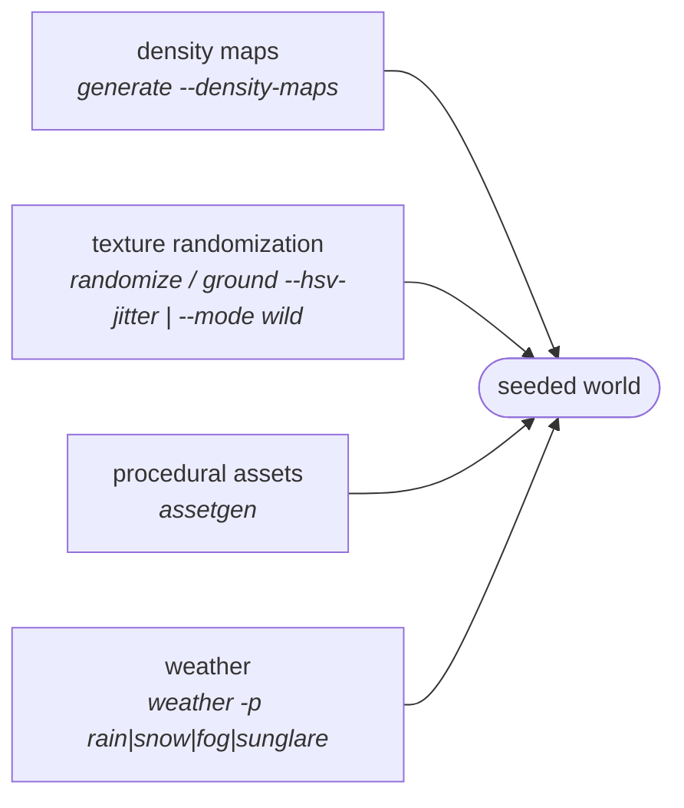

# Domain randomization & environment variation

WildSeed generates **worlds, not robots**: robots, sensors and autonomy stacks
live in a separate repository and are spawned into these worlds there. Everything
below changes what the world looks like — and everything is seeded, so any
randomized world can be regenerated exactly.

Four independent axes of variation, composable in any combination:



| Axis | Command | What varies |
|---|---|---|
| WHERE things grow | `wildseed generate --density-maps` | spatial layout from a grayscale image |
| WHAT things look like | `wildseed randomize`, `wildseed ground --hsv-jitter/--mode wild` | texture colours (assets + ground) |
| WHAT things exist | `wildseed assetgen` | fully synthetic parametric assets |
| ATMOSPHERE | `wildseed weather` | sun angle/intensity, fog, rain, snow, glare |

Texture randomization is deliberately allowed to be *unrealistic*: randomized-texture
training (Tobin et al. 2017) shows perception models trained across wild appearance
variation transfer better to the real world.

---

## 1. Density-map placement (grayscale image → vegetation layout)

Instead of the built-in zone/cluster heuristics, placement probability can follow a
grayscale image: **white = dense, black = never**. The image is stretched over the
full terrain extent, **north-up** (row 0 = +Y edge, column 0 = -X edge). Positions
are drawn exactly proportional to pixel intensity (CDF inversion, not rejection), so
even a 99%-black map places every requested instance in the white sliver. Distance
constraints and collision avoidance still apply.

```bash
# one map steering everything
wildseed generate --seed 7 --density-maps clearing.png

# per-category maps; '*' is the fallback for unmapped categories
wildseed generate --seed 7 \
    --density-maps '{"tree": "canopy.png", "grass": "meadow.png", "*": "veg.png"}'
```

Use cases: carve a keep-out corridor for a flight path, paint a forest edge,
reproduce real-world canopy cover from a segmented orthophoto.

## 2. Texture randomization

### Ground

```bash
# seeded hue/sat/value shift of the baked ground albedo (0..1 strength)
wildseed ground --mode patchy --biome grassland --seed 42 --hsv-jitter 0.6

# fully procedural UNREALISTIC ground: random colour ramps + blobs/stripes/
# checkers. Needs no texture packs at all.
wildseed ground --mode wild --seed 99
```

The HSV shift is global, so normal/roughness maps stay registered with the albedo.

### Converted models

```bash
# 3 recoloured variants of every tree/bush/rock/grass model: <model>_dr0..2
wildseed randomize --variants 3 --seed 7 --strength 0.5

# 'wild' = duotone recolour through random colours (structure kept, colours arbitrary)
wildseed randomize -c tree,bush --mode wild --seed 42
```

This rewrites the base-colour textures embedded in each model's visual `.glb`
and stamps out sibling model dirs that
`wildseed generate` picks up as extra species. Guarantees:

- only `baseColorTexture` images are touched — normal/roughness maps untouched;
- the alpha channel is preserved byte-exact, so foliage cutouts keep working;
- deterministic: variant RNG derives from `(seed, crc32(category/model), k)`.

## 3. Procedural asset generation (`assetgen`)

Seeded parametric assets built headless in Blender — no downloads, no artists:

```bash
wildseed assetgen --kind all -n 3 --seed 42        # 3 rocks, boulders, trees, ...
wildseed assetgen --kind conifer -n 5 --seed 7     # just conifers
wildseed assetgen -k rock -n 10 --no-convert       # .blend only
```

Kinds: `rock`, `boulder` (big rock), `tree` (broadleaf), `conifer`, `bush`,
`grass` — mapped to the standard placement categories. Geometry: noise-displaced
icospheres (rocks, canopies, bushes), tapered cones (trunks, branches, conifer
tiers), hand-built tapered blades (grass). Materials are solid-colour Principled
BSDF — no textures, no alpha, so converted models are tiny (7–55 KB) and the
glTF MASK foliage pitfall never applies. Collisions: convex hull (rocks),
trunk cylinder (trees/bushes), box (grass); grass/bush stay passable with the
usual `laser_retro` class labels.

Child seeds are extensible: `--count 5 --seed 42` reproduces the three assets a
`--count 3 --seed 42` run made, plus two new ones. Blender is required (it is in
the `wildseed:egl` image; `.blend` output lands in `Blender-Assets/generated/`).

Combine with `wildseed randomize --mode wild` for fully synthetic,
arbitrarily-coloured scene content.

## 4. Weather (`weather`)

Post-processes a generated world in place (idempotent — re-applying replaces the
previous weather):

```bash
wildseed weather -w worlds/scenario_42.world -p rain          # dark sky + rainfall
wildseed weather -w worlds/scenario_42.world -p snow --rate 800
wildseed weather -w worlds/scenario_42.world -p fog
wildseed weather -w worlds/scenario_42.world -p sunglare --sun-azimuth 0
wildseed weather -w worlds/scenario_42.world -p clear         # remove weather
```

Presets: `clear`, `overcast`, `fog`, `rain`, `snow`, `sunglare`. Knobs:
`--sun-elevation`, `--sun-azimuth`, `--sun-intensity`, `--rate`, `--fall-height`.

Implementation notes (gz-sim 8 "Harmonic"):

- rain/snow are terrain-sized SDF `<particle_emitter>` sheets emitting straight
  down (gz emitters emit along +X, so the emitter pose pitches ±90°); fog is a
  ground-hugging upward-drift volume — the same pattern as gz's own
  `fog_generator` demo, because ogre2 has no fixed-function scene fog.
  The `gz-sim-particle-emitter-system` plugin is injected automatically and the
  emitter model is written to `models/weather_<preset>/`.
- `sunglare` sets a very bright sun ~10° above the horizon (full specular) plus
  an emissive sun-disk model, so forward cameras see a real glare source.
- **True lens flare is a per-camera plugin** and cameras live in the robot repo:
  `wildseed weather --show-lens-flare-snippet -w <any>` prints the
  `gz-sim-lens-flare-system` XML to paste inside your `<sensor type="camera">`.
- Particles never collide with robots (no physics). They show in camera sensors
  and the GUI, and gz-rendering additionally *scatters* `gpu_lidar` / depth-camera
  rays passing through them (`particle_scatter_ratio`), so rain and fog degrade
  lidar the way real weather does — usually exactly what a perception test wants.
- Snow *cover* (white ground) is a ground biome, not weather:
  `wildseed ground --mode patchy --biome snow`.

---

## A fully randomized world, end to end

```bash
wildseed terraingen --preset hilly --seed 42 --out dem/w42.tif
wildseed terrain --dem dem/w42.tif
wildseed ground --mode wild --seed 42                      # DR ground
wildseed assetgen --kind all -n 2 --seed 42                # synthetic species
wildseed randomize --variants 2 --seed 42 --mode wild      # recolour everything
wildseed generate --seed 42 --density-maps layout.png      # painted layout
wildseed weather -w worlds/forest_world.world -p sunglare  # hard lighting
```
