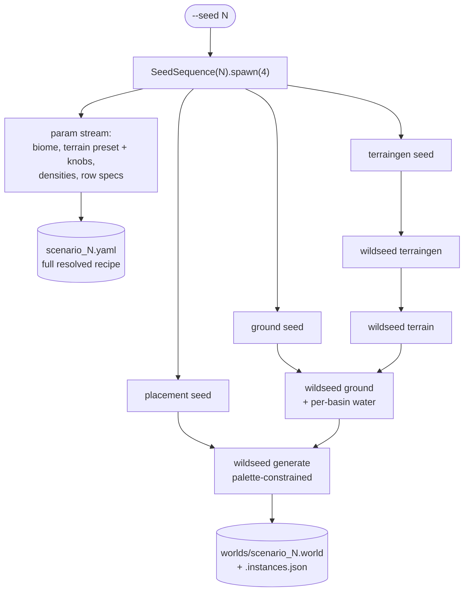

# WildSeed demo scenarios

Six complete, **reproducible** outdoor scenarios built entirely from the seeded
pipeline (`terraingen → terrain → ground → generate`) and **CC0 Poly Haven assets**
(credential-free — no account/login needed). Two are snow scenes. Every command below
is copy-pasteable inside the `wildseed:egl` container (prefix with the Docker wrapper
from `docs/TUTORIAL.md`).

## Reproduce everything in two steps

```bash
# 1. Build the asset set (fetch -> normalize -> convert; idempotent, ~50 assets, all CC0)
python3 tools/build_assets.py

# 2. Build all six scenarios + render the galleries (GRAFT_SUN=1 -> each
#    world's own sun/sky, how the committed galleries are rendered)
GRAFT_SUN=1 python3 tools/build_scenarios.py    # writes tools/scenarios_gallery.png + _overview.png
```

`build_assets.py` reads `assets/manifest.yaml` (the asset list + per-biome palettes)
and writes `assets/manifest.lock.yaml` with each source's sha256. All assets are CC0
(Poly Haven, https://polyhaven.com) — see `tools/ASSET_REGISTRY.md` for full credits.

## One-command randomized worlds (`wildseed scenario`)

For VIO/LIO test campaigns you usually want *many* varied worlds, not the six
fixed demos. `wildseed scenario` generates a complete world from **one master
seed**: it derives per-stage seeds (`SeedSequence.spawn`), draws the biome,
terrain preset/knobs and densities from per-biome envelopes (see `BIOME_SPACE`
in `src/wildseed/core/scenario.py`), runs
`terraingen → terrain → ground → generate` (plus per-basin water when the biome
calls for it), and constrains species to the biome's palette from
`assets/manifest.yaml`.



```bash
wildseed scenario --seed 42                      # random biome + everything else
wildseed scenario --seed 42 --biome alpine       # fix the biome, randomize the rest
wildseed scenario --seed 7  --density-scale 0.5  # sparse variant of seed 7
wildseed scenario --seed 7  --dry-run            # inspect the recipe, build nothing
```

Eight biomes: the six wilderness ones below plus two **structured plantations**
(CropCraft-inspired) — `orchard` (tree rows on grassland) and `vineyard` (vine
rows on dry ground). Structured biomes are deliberately monoculture and
repetitive — the hardest case for loop closure / place recognition. Their row
geometry (row/plant spacing, bounded field size, field rotation, lateral
jitter, missing-plant dropout, row waviness) is drawn from per-biome envelopes
and recorded in `scenario.yaml` like every other knob. The rows are
machine-straight but the plants are not: visible per-plant jitter, gap rates
and — for orchard trees — random canopy yaw keep the block from reading as a
printed lattice (scenario format 5), while staying the repetitive
place-recognition stressor. The same engine is
available manually: `wildseed generate --rows '{"tree": {"row_distance": 6,
"plant_distance": 4, "field_size": 80, "missing": 0.1}}'`.

Outputs: `worlds/scenario_<seed>.world`, `worlds/scenario_<seed>.instances.json`
— per-instance **ground truth** (name, model id, category, pose xyzrpy, scale
for every placed object, in placement order) — plus `worlds/scenario_<seed>.yaml`,
which records every resolved parameter (stage seeds, knobs, densities, rows,
palette), so a failing VIO run can name the exact world it saw and anyone can
regenerate it byte-identically from the seed. The mapping seed→world is stable
within a `scenario_format` version (bumped if the envelopes or draw order ever
change). Converted models also carry per-category `laser_retro` (tree=1 bush=2
rock=3 grass=4, ground 0) so lidar intensity doubles as a class label, and
grass/bush collisions are passable (`collide_without_contact`) so robots drive
through understory while still seeing it.

## Adjusting density (trees, rocks, bushes, grass)

Density is the main knob and is fully user-tunable. Each scenario sets per-category
counts; override them per run without touching anything else:

```bash
# More trees, fewer rocks, dense understory:
wildseed generate --density '{"tree":80,"rock":6,"bush":40,"grass":120}' --seed 7
```

Categories: `tree`, `bush`, `rock`, `grass`, `sand` (bounds in
`src/wildseed/config/schema.py`: e.g. tree 0–1000, grass 0–2000). Same `--seed` →
identical placement. Each scenario constrains *species* to its biome palette (the
builder stashes models not in `assets/manifest.yaml`'s `biomes.<name>`), so changing a
count rescatters that biome's plants, not a random global mix.

Each scenario uses seed 7 for ground; terrain/placement seeds are per scenario below.

---

## 1. Temperate hills  🌳
Rolling green hills, broadleaf forest (island/jacaranda) with shrub + grass understory.

```bash
wildseed terraingen --preset hilly --seed 7 --detail 0.5 -o dem/synth.tif
wildseed terrain    --dem dem/synth.tif
wildseed ground     --mode patchy --biome grassland --seed 7
wildseed generate   --density '{"tree":40,"rock":12,"bush":24,"grass":60}' --seed 7
```

## 2. Savanna flats  🏜️
Arid flats: sparse quiver trees, dry scrub, desert bloom, lots of rock.

```bash
wildseed terraingen --preset hilly --seed 3 --amplitude 14 --detail 0.4 -o dem/synth.tif
wildseed terrain    --dem dem/synth.tif
wildseed ground     --mode patchy --biome desert --seed 7
wildseed generate   --density '{"tree":6,"rock":22,"bush":12,"grass":30}' --seed 7
```

## 3. Lakeland wetland  💧
Basins that hold water at their own levels, ferns/reeds + dense grass along the shores.

```bash
wildseed terraingen --preset lakeland --seed 7 -o dem/synth.tif
wildseed terrain    --dem dem/synth.tif
wildseed ground     --mode patchy --biome grassland --seed 7
wildseed ground     --mode patchy --biome grassland --seed 7 --auto-water --dem dem/synth.tif
wildseed generate   --density '{"tree":26,"rock":8,"bush":28,"grass":50}' --seed 7
```
(The second `ground` call adds one water plane per basin; see `docs/TUTORIAL.md` §4.)

## 4. Alpine snow  ❄️  *(snow)*
Rugged snowy massif, conifers (fir/pine) and many boulders — high-relief alpine.

```bash
wildseed terraingen --preset mountainous --seed 7 --ridged 0.2 --detail 0.6 -o dem/synth.tif
wildseed terrain    --dem dem/synth.tif
wildseed ground     --mode patchy --biome snow --seed 7
wildseed generate   --density '{"tree":16,"rock":26,"bush":8,"grass":18}' --seed 7
```

## 5. Winter forest  ❄️  *(snow)*
A snowy valley with conifers and dead trunks.

```bash
wildseed terraingen --preset valley --seed 5 --detail 0.6 -o dem/synth.tif
wildseed terrain    --dem dem/synth.tif
wildseed ground     --mode patchy --biome snow --seed 7
wildseed generate   --density '{"tree":35,"rock":10,"bush":0,"grass":22}' --seed 7
```

## 6. Coastal dune  🏖️
Low windswept dunes: marram-style grass, dune shrubs/iceplant, coastal rocks.

```bash
wildseed terraingen --preset hilly --seed 11 --amplitude 9 --detail 0.35 -o dem/synth.tif
wildseed terrain    --dem dem/synth.tif
wildseed ground     --mode patchy --biome desert --seed 7
wildseed generate   --density '{"tree":8,"rock":14,"bush":20,"grass":45}' --seed 7
```

---

### Notes
- Render any scenario with the harness in `docs/TUTORIAL.md` §2 (`FOREST=1
  python3 tools/terrain_scene.py` then `gz sim ...`). Add `WATER=1` for lakeland.
- Species per scenario come from `assets/manifest.yaml` → `biomes.<name>`. Add a
  Poly Haven id to the `assets` list + a biome palette, run `build_assets.py`, and it
  joins the scatter.
- Heights/relief, surface smoothness, biome, and density are independent knobs — mix
  freely to derive new scenarios.
