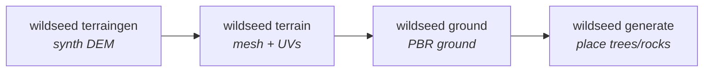

# Procedural Terrain Generator (`wildseed terraingen`)

Synthesize **seeded, varied landforms** — hills, mounts, valleys, flatlands,
basins→lakes, creeks. The same `--seed`
always reproduces the same terrain (so a whole VIO/lidar test scenario can be
regenerated exactly); a new seed gives a new world.

It writes a **GeoTIFF DEM**, which feeds the rest of the pipeline (terrain → ground → generate):



## Quick start (Docker, GPU)

```bash
# 1. synthesize a landform  (writes dem/synth.tif [+ dem/synth.lakes.json])
wildseed terraingen --preset hilly --seed 7 --size 192 -o dem/synth.tif
# 2. mesh it (overwrites models/ground)
wildseed terrain --dem dem/synth.tif
# 3. texture the ground (uniform crisp, or patchy seeded composite)
wildseed ground --mode patchy --biome grassland --seed 7
# 4. populate it (reproducible placement)
wildseed generate --density '{"tree":40,"rock":12,"bush":20}' --seed 7
```

The render harness used in this repo is `tools/terrain_scene.py` (+ `capture_cams.py`);
see `docs/TUTORIAL.md` for the full Docker render recipe.

## Presets

| preset        | character                                              | features |
|---------------|--------------------------------------------------------|----------|
| `flat`        | gentle flatland with a slight planar tilt              | low amplitude + slope |
| `hilly`       | rolling hills                                          | fBm only |
| `valley`      | a central trough between higher ground, a creek        | ridged + valley + creek |
| `mountainous` | rugged high-relief massif                              | high amplitude + ridged + peaks |
| `lakeland`    | gentle ground with basins that hold water + a creek    | basins + creek |

Each preset is a bundle of feature defaults; **any CLI flag overrides** the preset.

## Flags (all optional; presets supply defaults)

```
--preset {flat,hilly,valley,mountainous,lakeland}
--seed N                 same seed -> same landform
--size N                 DEM pixels per side (== mesh density). Default 192 (~480 m @ 2.5 m/px).
--pixel M                metres per pixel (default 2.5)
--out PATH               output GeoTIFF (default dem/synth.tif)

# shape
--amplitude M            fBm base relief (m)
--feature M              largest hill feature size (m)
--octaves N              fBm octave count
--roughness R            per-octave amplitude falloff (persistence); lowers ALL detail
--detail D               0..1: fine-octave weight. Smooths the surface while KEEPING the
                         macro hill/mountain pattern. detail=1 (default) = full detail,
                         detail=0 = glass-smooth slopes, same hills.
--ridged R               0..1: ridged-noise blend (sharper ridges/valleys; main driver of
                         the "spongy" look on mountainous — lower it for a cleaner massif)
--slope M                planar tilt added across the map (flatlands)

# discrete features
--peaks N                Gaussian peaks/mounts
--basins N               basins (mini-lakes); each emits a suggested water level
--creeks N               carved creek channels
--creek-depth M          creek channel depth
--creek-width M          creek flat-bed width

# finishing
--edge-taper F           border relief taper (avoid cliff edges); lakeland uses less
--smooth S               final anti-facet Gaussian sigma (px)
```

### Local smoothness vs. global pattern
`--roughness` dampens *all* octaves above the first, so turning it down also flattens
the rolling mid-scale hills. Use **`--detail`** when you want to keep the big landform
but calm the fine surface "sponginess":

```bash
wildseed terraingen --preset hilly --seed 7 --detail 0.2   # smooth surface, SAME hills
wildseed terraingen --preset mountainous --seed 7 --ridged 0.2 --detail 0.6  # cleaner massif
```

Lakes, peaks, the valley trough, and creeks are added as *separate* features, so
surface roughness never disturbs them.

## Lakes & water

`lakeland` (or any `--basins N>0`) carves basins and writes a sidecar
`dem/<name>.lakes.json`:

```json
{"lakes": [{"center_px":[c,r], "center_xy_m":[x,y], "radius_m":R,
            "floor_z":F, "suggested_water_level":L}, ...]}
```

`floor_z` / `suggested_water_level` are in the **meshed terrain's Z frame** (the
pipeline shifts the mesh so its minimum Z = 0, in metres at the default scale).
Place water with `wildseed ground`:

```bash
# single global plane at one level (floods everything below it):
wildseed ground --mode patchy --biome grassland --water-level <L>
# OR one plane PER basin, each at its own level (reads the sidecar):
wildseed ground --mode patchy --biome grassland --auto-water --dem dem/synth.tif
```

(`--auto-water` is described in `docs/TUTORIAL.md`.)

## How it works (one paragraph)

`core/terraingen.py::TerrainSynthesizer` builds a float heightfield in metres:
an fBm base (octaves of Gaussian-smoothed noise, generated on a padded grid and
center-cropped to avoid boundary artifacts), optionally blended with ridged noise
and a parabolic valley trough; then Gaussian peaks are *added* and basins/creeks
are *carved* in metres (so physical lake/creek depths stay meaningful); a final
smooth removes faceting and the field is shifted so its minimum is 0. It is written
as a north-up GeoTIFF (only the pixel size matters to the downstream mesher; CRS is
set for parity but optional). Everything is driven by `numpy.random.default_rng(seed)`.

## Reproducibility

`terraingen --seed N` twice → identical DEM.

## Gallery

`tools/terrain_gallery.png` (5 presets), `tools/terrain_seeds.png` (seed variation),
`tools/diag_detail.png` (surface-smoothness control). Demo scenarios built on top of
this: see `docs/SCENARIOS.md`.
