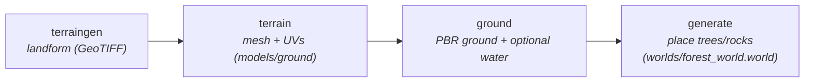

# WildSeed tutorial — build & randomize a world

A 5-minute guide to generating a complete, randomized outdoor world (terrain →
ground → trees/rocks) and rendering it on the GPU. Everything is **seeded**: the
same `--seed` reproduces the same world; change it for a new one.

> All commands run inside the `wildseed:egl` Docker image (WildSeed + Blender 4.2 +
> Gazebo Harmonic + GDAL + NVIDIA EGL). To pick up local `src/` edits, add
> `-e PYTHONPATH=/workspace/src`.

## 0. The one-liner mental model



Each step writes into `models/` (and the last into `worlds/`); each is one CLI call.

## 1. Run the pipeline

```bash
docker run --rm --gpus all -e NVIDIA_DRIVER_CAPABILITIES=all \
  -e PYTHONPATH=/workspace/src -e GZ_SIM_RESOURCE_PATH=/workspace/models \
  -v "$PWD:/workspace" --entrypoint bash wildseed:egl -c '
  cd /workspace
  # 1) synthesize a landform (writes dem/synth.tif)
  wildseed terraingen --preset hilly --seed 7 --size 192 -o dem/synth.tif
  # 2) mesh it (writes models/ground)
  wildseed terrain --dem dem/synth.tif
  # 3) texture the ground (seeded patchy composite: grass + sand/gravel patches + trail)
  wildseed ground --mode patchy --biome grassland --seed 7
  # 4) place trees/rocks (writes worlds/forest_world.world)
  wildseed generate --density "{\"tree\":40,\"rock\":12,\"bush\":0}" --seed 7
'
```

`wildseed --help` (and `<cmd> --help`) lists every flag. The terrain knobs are in
`docs/TERRAIN_GENERATOR.md`.

## 2. Render it (GPU)

The repo ships a small render harness:

```bash
docker run --rm --gpus all -e NVIDIA_DRIVER_CAPABILITIES=all \
  -e PYTHONPATH=/workspace/src -e GZ_SIM_RESOURCE_PATH=/workspace/models \
  -v "$PWD:/workspace" --entrypoint bash wildseed:egl -c '
  cd /workspace
  FOREST=1 python3 tools/terrain_scene.py            # build a world w/ oblique + top-down cameras
  gz sim -s -r --headless-rendering worlds/terrain_scene.world > frames/gz.log 2>&1 &
  GZ=$!; python3 tools/capture_cams.py cam_oblique,cam_top; kill $GZ
'
# convert the captured frames to PNG (host, with Pillow):
python3 -c "from PIL import Image;import numpy as np;Image.fromarray(np.load('frames/cam_oblique.npy')).save('view.png')"
```

> Verify the GPU is real (not llvmpipe): `grep GL_VENDOR ~/.gz/rendering/ogre2.log`
> must say **NVIDIA**. Always pass `--gpus all -e NVIDIA_DRIVER_CAPABILITIES=all`.
> The top-down camera looks **down** with pitch `+1.5708`.

## 3. Randomize

Everything reproducible flows from seeds. Three independent seeds:

| seed | controls | flag |
|------|----------|------|
| terrain | the landform shape | `terraingen --seed N` |
| ground | patch/trail layout | `ground --seed N` |
| placement | tree/rock positions | `generate --seed N` |

Use the **same N everywhere** for a fully-coupled, reproducible scenario; vary one
to perturb just that aspect. A loop over seeds gives a batch of distinct worlds:

```bash
for S in 1 2 3 4 5; do
  wildseed terraingen --preset hilly --seed $S -o dem/synth.tif
  wildseed terrain    --dem dem/synth.tif
  wildseed ground     --mode patchy --biome grassland --seed $S
  wildseed generate   --density "{\"tree\":40,\"rock\":12}" --seed $S -o worlds/world_$S.world
done
```

Other things to vary:
- **landform**: `--preset {flat,hilly,valley,mountainous,lakeland}`, `--amplitude`,
  `--detail` (surface smoothness without changing the hills — see TERRAIN_GENERATOR.md).
- **biome / look**: `ground --biome {grassland,desert,gravel,snow}`,
  `--mode {uniform,patchy}`.
- **population**: `generate --density '{"tree":N,"rock":M,"bush":K}'`.

## 4. Lakes (water)

`terraingen --preset lakeland` (or any `--basins N`) carves basins and writes
`dem/synth.lakes.json`. Add water two ways:

```bash
# one global plane (simple; floods everything below the level):
wildseed ground --mode patchy --biome grassland --water-level 5.5
# OR one plane per basin at its own level (recommended for multiple lakes):
wildseed ground --mode patchy --biome grassland --auto-water --dem dem/synth.tif
```

The render harness (`FOREST=1 ... terrain_scene.py`) includes every `water*` model
automatically.

## 5. Realistic assets

Trees/rocks under `models/<category>/` are placed at random by `generate` (one
random variant per slot). To control *which* species appear, keep only the variants
you want in `models/<category>/` (move the rest aside). The CC0 assets shipped here
and how to (re)fetch them are documented in `tools/ASSET_REGISTRY.md`; the fetch +
normalize scripts are `tools/fetch_polyhaven.py` and `tools/import_gltf.py`.

## 6. Ready-made scenarios

Six complete demo scenarios (incl. two snow) with exact commands and images:
**`docs/SCENARIOS.md`**. Rebuild them all with `tools/build_scenarios.py`.
